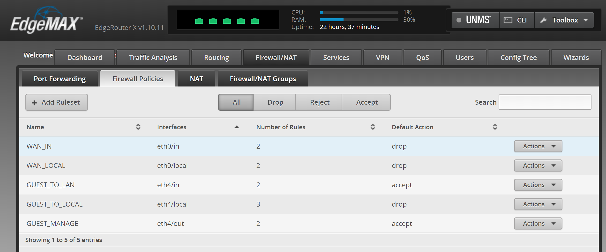

### Guest Network

------
#### Sources:

Ubiquiti [Create a Guest\LAN Firewall Rule](https://help.ui.com/hc/en-us/articles/218889067-EdgeRouter-How-to-Create-a-Guest-LAN-Firewall-Rule#5)

Write-up [Using the Ubiquiti EdgeRouter X](https://www.grc.com/sn/files/Ubiquiti_Home_Network.pdf)

YouTube [Firewall setup](https://www.youtube.com/watch?v=W3pLRKHMS4o)

------

Setup on Ubiquiti EdgeRouter setup with "Basic Setup" wizard

Guest network on interface eth4

#### Step 1, Add Guest Subnet

Remove VLAN switch port eth4 from switch0

Private network on 192.168.1.0/24

Configure interface eth4, manually define ip address: `192.168.2.0/24`

Add second DHCP server:

| Name | Value
| --- | ---
| DHCP Name | `LAN_GUEST`
| Subnet | `192.168.2.0/24`
| Range | `192.168.2.38 - 243`
| Router | `192.168.2.1`
| DNS 1 | `208.67.222.222`
| DNS 2 | `9.9.9.9`

Reboot access point on eth4

### Step 2, Add Firewall Group

Configure the PRIVATE_NETWORK network group

Add Group

Name: `LAN_GUEST`

Group Type: `Network Group`

### Step 3, Add Firewall Policies

GUEST_LOCAL

GUEST_IN

GUEST_MANAGE

Attach the firewall policies to the ** eth* ** interface in the ** inbound, local, or out ** direction

    name GUEST_MANAGE {
        default-action accept
        description ""
        rule 1 {
            action accept
            destination {
                address 192.168.2.38
            }
            log disable
            protocol all
            source {
                group {
                    network-group LAN_PRIVATE
                }
            }
        }
        rule 2 {
            action drop
            log disable
            protocol all
            source {
                group {
                    network-group LAN_PRIVATE
                }
            }
        }
    }
    name GUEST_TO_LAN {
        default-action accept
        description "guest to lan"
        rule 1 {
            action accept
            description established
            log disable
            protocol all
            state {
                established enable
                invalid disable
                new disable
                related enable
            }
        }
        rule 2 {
            action drop
            description "network group"
            destination {
                group {
                    network-group LANs
                }
            }
            log disable
            protocol all
        }
    }
    name GUEST_TO_LOCAL {
        default-action drop
        description "guest to router"
        rule 1 {
            action accept
            description established
            log disable
            protocol all
            state {
                established enable
                invalid disable
                new disable
                related enable
            }
        }
        rule 2 {
            action accept
            description DNS
            destination {
                port 53
            }
            log disable
            protocol tcp_udp
        }
        rule 3 {
            action accept
            description DHCP
            destination {
                port 67
            }
            log disable
            protocol udp
        }
    }